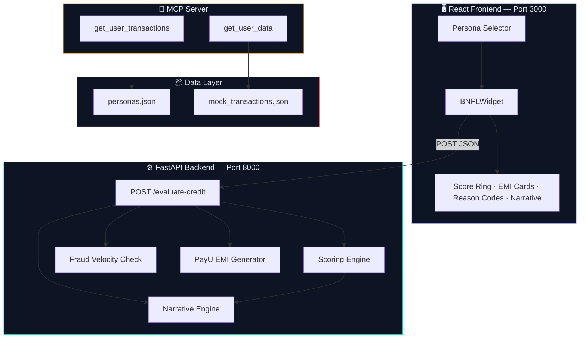

<p align="center">
  
</p>

<h1 align="center">
  🏦 GrabCredit — Explainable BNPL Engine
</h1>

<p align="center">
  <strong>A production-grade Buy Now Pay Later checkout system with transparent, data-driven credit decisioning.</strong>
</p>

<p align="center">
  <em>Built for the GrabOn Vibe Coder Challenge — from zero to live product in one sprint.</em>
</p>

<br/>

<p align="center">
  
  
  
  
  
</p>

<p align="center">
  
  
  
  
</p>

---

<br/>

## 🎯 Project Goal

> **Eliminate the black box.** Traditional BNPL systems tell users *"You're rejected"* with zero explanation. GrabCredit flips that model — every decision is transparent, every score factor is visible, and every user gets a personalized, data-backed narrative explaining exactly *why*.

This project demonstrates a **full-stack fintech product** that:

- ✅ Evaluates **5 distinct user personas** (from zero-history to power user)
- ✅ Returns **differentiated decisions** — Approved / Partially Approved / Rejected
- ✅ Provides **explainable scoring** with a visual breakdown of every factor
- ✅ Generates **personalized credit narratives** ("You qualify because…")
- ✅ Offers **realistic EMI plans** (3/6/9 months) with actuarial math
- ✅ Detects **fraud velocity** (accounts < 7 days old are flagged)
- ✅ Presents everything in a **premium, dark-mode checkout widget**

---

<br/>

## 🏗️ Architecture Overview



---

<br/>

## 🧮 How the Scoring Engine Works

The credit score is calculated on a **0–100 scale** using 5 weighted factors:

| # | Factor | Max Points | What It Measures |
|:-:|--------|:----------:|-----------------|
| 1 | **Income Adequacy** | 20 | Monthly income vs ₹50K baseline |
| 2 | **Transaction Frequency** | 20 | Purchase count (log-curve scaling) |
| 3 | **Repayment Consistency** | 30 | On-time repayment ratio — *heaviest weight* |
| 4 | **Account Maturity** | 15 | Account age in days (< 7 days = penalty) |
| 5 | **Risk Adjustments** | ±15 | Category diversity, return rate, liability ratio, coupon engagement |

### Decision Thresholds

```
 ┌────────────────────────────────────────────────────────────┐
 │  ≥ 75 pts  │  APPROVED           │  Full limit · 0% APR   │
 │  45–74 pts │  PARTIALLY APPROVED │  Reduced limit · 8–18% │
 │  < 45 pts  │  REJECTED           │  No credit line        │
 └────────────────────────────────────────────────────────────┘
```

### Persona Score Outcomes

| Persona | Transactions | Repayment | Score | Decision |
|---------|:-----------:|:---------:|:-----:|----------|
| 🧑‍💻 Arjun (New User) | 0 | 0% | ~3 | ❌ Rejected |
| 👩‍🎓 Priya (Low Activity) | 8 | 75% | ~28 | ❌ Rejected |
| 👨‍💼 Rahul (Average) | 45 | 91% | ~65 | ⚠️ Partial |
| 👩‍💻 Sneha (Good Credit) | 120 | 96% | ~88 | ✅ Approved |
| 🚀 Vikram (Power User) | 267 | 99% | ~97 | ✅ Approved |

---

<br/>

## 🛠️ Tech Stack & Role of Each

<table>
<tr>
<td width="50%">

### ⚙️ Backend

| Technology | Role |
|-----------|------|
| **Python 3.11+** | Core language for all server-side logic |
| **FastAPI** | High-performance async API framework with automatic OpenAPI docs |
| **Uvicorn** | ASGI server for running FastAPI in production |
| **MCP SDK** | Model Context Protocol server for standardized tool-based data access |
| **Pydantic** | Request/response validation with typed schemas |

</td>
<td width="50%">

### 🖥️ Frontend

| Technology | Role |
|-----------|------|
| **React 19** | Component-based UI with hooks for state management |
| **CSS3 (Custom)** | Hand-crafted design system — no Tailwind, no Bootstrap |
| **Google Fonts** | Syne (display) + Plus Jakarta Sans (body) for premium typography |
| **SVG** | Animated score ring and custom logo, all inline |
| **Fetch API** | Native HTTP client for backend communication |

</td>
</tr>
</table>

### 🧩 Service Modules

| Module | File | Purpose |
|--------|------|---------|
| **Scoring Engine** | `services/scoring.py` | Formula-driven 5-factor credit scoring with full breakdown |
| **Narrative Engine** | `services/narrative.py` | Deterministic, personalized "You qualify because…" text generation |
| **Fraud Detection** | `services/fraud.py` | Velocity check — flags accounts registered < 7 days ago |
| **PayU Mock** | `services/payu.py` | Simulates PayU LazyPay EMI disbursal (3/6/9 month plans) |
| **LLM Client** | `services/llm_client.py` | Optional Claude/OpenRouter integration for AI narratives |
| **MCP Server** | `mcp_server/server.py` | Exposes transaction data via MCP `stdio` protocol |

---

<br/>

## 🔄 Project Flow — End to End

```
┌─────────────┐     ┌──────────────┐     ┌──────────────────┐
│  User picks  │────▶│  React sends │────▶│  FastAPI receives │
│  a Persona   │     │  POST request│     │  persona JSON     │
└─────────────┘     └──────────────┘     └────────┬─────────┘
                                                   │
                    ┌──────────────────────────────┼──────────────────┐
                    │                              ▼                  │
                    │  ┌─────────────┐  ┌──────────────────┐         │
                    │  │ Fraud Check │  │  Scoring Engine   │         │
                    │  │ (velocity)  │  │  (5 factors)      │         │
                    │  └─────────────┘  └────────┬─────────┘         │
                    │                            ▼                    │
                    │              ┌──────────────────────┐           │
                    │              │  Decision Engine     │           │
                    │              │  (thresholds + EMI)  │           │
                    │              └────────┬─────────────┘           │
                    │                       ▼                         │
                    │         ┌──────────────────────┐                │
                    │         │  Narrative Engine    │                │
                    │         │  (personalized text) │                │
                    │         └────────┬─────────────┘                │
                    │                  ▼                               │
                    │     ┌────────────────────────┐                  │
                    │     │  Full JSON Response    │                  │
                    │     │  score + breakdown +   │                  │
                    │     │  EMI + reasons +       │                  │
                    │     │  narrative             │                  │
                    │     └────────────────────────┘                  │
                    └─────────────────────────────────────────────────┘
                                         │
                                         ▼
                    ┌──────────────────────────────────────┐
                    │  React Widget renders:               │
                    │  • Animated score ring                │
                    │  • Status badge (glow effect)         │
                    │  • EMI plan cards (selectable)        │
                    │  • Reason codes (✓ / – / ✗)          │
                    │  • Credit narrative (italic block)    │
                    │  • CTA button (contextual)           │
                    └──────────────────────────────────────┘
```

---

<br/>

## 📁 Project Structure

```
grabcredit/
├── backend/
│   ├── app.py                     # FastAPI entry point — all routes
│   ├── requirements.txt           # Python dependencies
│   ├── mcp_client.py              # MCP client connector
│   ├── mcp_server/
│   │   ├── server.py              # MCP stdio server (FastMCP)
│   │   └── transaction_api.py     # Transaction data tools
│   ├── services/
│   │   ├── scoring.py             # 5-factor credit scoring engine
│   │   ├── narrative.py           # Personalized narrative generator
│   │   ├── fraud.py               # Velocity-based fraud detection
│   │   ├── payu.py                # Mock PayU EMI disbursal
│   │   └── llm_client.py          # Optional AI narrative client
│   └── data/
│       ├── personas.json          # 5 test persona definitions
│       ├── mock_transactions.json # Synthetic transaction dataset
│       ├── users.json             # User profile data
│       └── generate_data.py       # Data generation script
│
├── frontend/
│   ├── public/
│   └── src/
│       ├── App.js                 # Main layout + persona selector
│       ├── index.css              # Full design system (500+ lines)
│       ├── components/
│       │   └── BNPLWidget.js      # Core checkout widget
│       └── services/
│           └── api.js             # Backend API client
│
├── .gitignore
└── README.md                      # ← You are here
```

---

<br/>

## 🚀 Quick Start

### Prerequisites

```
Python 3.11+    Node.js 18+    npm 9+
```

### 1️⃣ Backend

```bash
cd backend
pip install -r requirements.txt
uvicorn app:app --reload --port 8000
```

### 2️⃣ Frontend

```bash
cd frontend
npm install
npm start
```

### 3️⃣ Open

Navigate to **http://localhost:3000** — click through the 5 personas and watch the widget respond in real-time.

---

<br/>

## 🧪 API Reference

### `POST /evaluate-credit`

**Request Body:**
```json
{
  "id": "U004",
  "name": "Sneha Kapoor",
  "monthly_income": 85000,
  "transaction_count": 120,
  "repayment_ratio": 0.96,
  "categories_used": ["Electronics", "Fashion", "Grocery", "Travel", "Home"],
  "return_rate": 0.03,
  "account_age_days": 540,
  "existing_liabilities": 10000,
  "coupon_redemption_rate": 0.7
}
```

**Response:**
```json
{
  "user_id": "U004",
  "score": 88,
  "status": "APPROVED",
  "credit_limit": 80000,
  "interest_rate": 0.0,
  "emi_plans": [
    { "months": 3, "emi_amount": 26667, "total_cost": 80000, "interest_rate": 0.0 },
    { "months": 6, "emi_amount": 13334, "total_cost": 80000, "interest_rate": 0.0 },
    { "months": 9, "emi_amount": 8889,  "total_cost": 80000, "interest_rate": 0.0 }
  ],
  "reason_codes": [
    { "type": "positive", "factor": "Repayment", "text": "Excellent repayment consistency (96%)" },
    { "type": "positive", "factor": "Activity",  "text": "High platform engagement (120 transactions)" }
  ],
  "narrative": "Great news, Sneha! You qualify because of your excellent repayment consistency of 96%, a strong transaction footprint of 120 purchases, and a stable income profile of ₹85,000/month..."
}
```

---

<br/>

## 🛤️ Build Journey — From Scratch to Production

| Phase | What We Did |
|-------|-------------|
| **1 · Data Modeling** | Designed 5 user personas with 12+ attributes each — income, transaction count, repayment ratio, category diversity, return rate, account age, liabilities, coupon engagement |
| **2 · MCP Server** | Built a spec-compliant Model Context Protocol server using `FastMCP` with `stdio` transport, exposing `get_user_transactions` and `get_user_data` tools |
| **3 · Scoring Engine** | Implemented a 5-factor weighted scoring system (0–100) with non-linear curves, velocity penalties, and risk adjustments — fully transparent, no ML black box |
| **4 · Decision Engine** | Created threshold-based decisioning with actuarial EMI calculation using the standard annuity formula: `E = P·r(1+r)^n / ((1+r)^n - 1)` |
| **5 · Narrative Engine** | Built deterministic, personalized narrative generation — every user gets a unique explanation citing their specific behavioral signals |
| **6 · Fraud Layer** | Added velocity-based fraud detection that flags accounts younger than 7 days |
| **7 · FastAPI Server** | Assembled all services into a CORS-enabled REST API with Pydantic validation |
| **8 · React Frontend** | Designed a premium dark-mode checkout widget with animated SVG score rings, glassmorphic cards, shimmer loading skeletons, selectable EMI plans, and staggered reason codes |
| **9 · Design System** | Hand-crafted 500+ lines of CSS with Syne/Plus Jakarta Sans typography, teal-mint/amber/coral status palette, gradient mesh backgrounds, grain overlays, and micro-animations |
| **10 · Deployment Prep** | Configured environment-variable-based API URLs, `.gitignore`, and documented Render + Vercel deployment |

---

<br/>

## 🎨 Design Philosophy

```
┌──────────────────────────────────────────────────────┐
│                                                      │
│   "This should feel like a live fintech product,     │
│    not a hackathon demo."                            │
│                                                      │
│   • Midnight navy base (#070b14)                     │
│   • Animated gradient mesh background                │
│   • Film grain texture overlay                       │
│   • Glassmorphic card surfaces                       │
│   • Status-aware glow effects                        │
│   • Syne display + Plus Jakarta Sans body fonts      │
│   • Staggered fade-in animations                     │
│   • Shimmer loading skeletons                        │
│                                                      │
└──────────────────────────────────────────────────────┘
```

---

<br/>

## 📄 License

This project is built for the **GrabOn Vibe Coder Challenge** and is available under the [MIT License](LICENSE).

---

<p align="center">
  <strong>Built with 💜 for GrabOn</strong>
  <br/>
  <sub>Explainable credit decisioning for the next generation of fintech.</sub>
</p>

<p align="center">
  
</p>
